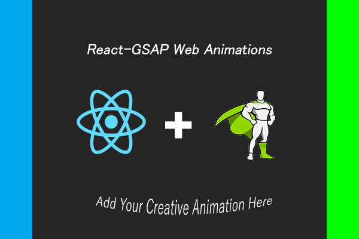
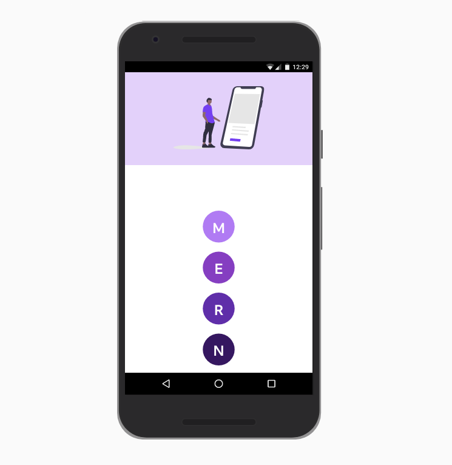

# React-GSAP-Animations



<br>

# Getting Started

## Prerequisites

<br>

- Install Node.Js with npm. click [here](https://nodejs.org/en/) 

## Libraries and Frameworks

<br>

- <b>REACT</b> <br> Click [here](https://reactjs.org/) to learn React

- <b>Material-UI</b> <br> Click [here](https://material-ui.com/) to learn Material-UI

- <b>GSAP</b> <br> Click [here](https://greensock.com/gsap/) to learn GSAP

## Installation

<br>

- Open the Terminal and clone the Project.
- Type &nbsp;&nbsp;&nbsp;&nbsp;&nbsp;```cd React-GSAP-Animations\client```
- Type &nbsp;&nbsp;&nbsp;&nbsp;&nbsp;```npm install``` &nbsp;&nbsp;&nbsp;&nbsp;&nbsp; or &nbsp;&nbsp;&nbsp;&nbsp;&nbsp;```yarn install```

- Type &nbsp;&nbsp;&nbsp;&nbsp;&nbsp; ```npm start``` &nbsp;&nbsp;&nbsp;&nbsp;&nbsp; or &nbsp;&nbsp;&nbsp;&nbsp;&nbsp;```yarn start```

<br>

# Contribution

<br>

- Fork the Repository.
- Create your own js file\files with any name in Components folder. (Don't edit existing JavaScript files.)

- Edit your Javascript file\files and build your creative animation.

- Responsive Web Design is REQUIRED.

- Import and Add your Animation Tag below the existing Tags in ```Landings\Signup.js```.

- Dont install other libraries or frameworks for GUI Elements.( MATERIAL-UI only )

- Take an Screen Shot of your animation in Mobile device and Save it in the ```React-GSAP-Animations\Images``` folder.

- Add your image, below the existing images in README.md file.

<br>

# Animations

## Animation 1

<br>



<br>

## Animation 2

<br>


<br>

## Animation 3

<br>

